### AWS VPC with Terraform Cloud (VCS-Driven Workspaces)
Provision an AWS VPC (public/private subnets, routing, and an optional demo EC2) using Terraform Cloud with VCS-connected workspaces. Backend selection is done via `-backend-config` using environment HCL files:

* dev.hcl → workspace: dev
* prod.hcl → workspace: prod

Runs are queued by Git pushes/PRs. State is fully remote in Terraform Cloud.

```mermaid
flowchart LR
  %% Team collaboration + gated promotion from dev -> main
  subgraph Team["Team Collaboration"]
    Dev[Developers]
    Rev[Reviewers]
  end

  subgraph GitHub["GitHub Repository"]
    DevBranch[(dev branch)]
    MainBranch[(main branch)]
    PR[Pull Request: dev → main]
  end

  subgraph TFC["Terraform Cloud"]
    WSDev[(Workspace: dev)]
    Plan[Plan]
    Apply[Apply]
    OK{Provision succeeded?}
  end

  Dev -->|push code| DevBranch
  DevBranch -->|VCS webhook| WSDev
  WSDev --> Plan --> Apply --> OK

  OK -- Yes --> PR
  PR --> Rev
  Rev -->|approve & merge| MainBranch
  Rev -->|request changes| Dev

  OK -- No --> Block[No PR opened]
  Block -->|fix & repush| Dev

  %% (Optional) Main branch can trigger downstream environments after merge
  %% MainBranch -.-> Next[Optional: prod workspace / further steps]
```



## Repo Layout
``` 
.
├── dev.hcl            # Backend config → Terraform Cloud (dev workspace)
├── prod.hcl           # Backend config → Terraform Cloud (prod workspace)
├── terraform.tf       # Terraform { cloud/remote } backend block + required settings
├── main.tf            # VPC, subnets, routing, optional demo EC2
├── variables.tf       # Inputs (CIDRs, AZs, toggles, instance type, etc.)
├── output.tf          # Outputs (env, public_ip_web_app, public_dns_web_app)
└── README.md
```

## How the backend is selected
You do not embed workspace names in code. Instead, you pass them at init time:
# dev
`terraform init -backend-config=dev.hcl -reconfigure`

# prod
`terraform init -backend-config=prod.hcl -reconfigure`
Those files contain the Terraform Cloud org/hostname and the workspace name to bind state and runs to the correct environment.

## Workflow (VCS-driven)
Because the workspaces are VCS-connected, you don’t run terraform apply from CLI. Use this flow:
1) Login & format (local)

`terraform login`
`terraform fmt`
2) Point to the correct workspace (local init only)

`terraform init -reconfigure -backend-config=dev.hcl   # or prod.hcl`
## Commit & push changes
`Git push (or open a PR). Terraform Cloud queues a Plan in the mapped workspace.`

4)Review & apply in Terraform Cloud UI

Open the run → Confirm & apply. Auto-Apply should remain off for prod.
Your history matches this:
terraform login → terraform fmt → terraform init -reconfigure → terraform init -backend-config=dev.hcl -reconfigure → terraform plan
For VCS workspaces, plan/apply are owned by TFC runs triggered from VCS. Treat local plan as non-authoritative.

## 📸 Screenshots

> All screenshots are from the VCS-driven Terraform Cloud workflow for this repo.

### Terraform Cloud – Dev Workspace

<p align="center">
  
  <br/><em>Dev workspace: plan finished (+19 to create).</em>
</p>

<p align="center">
  
  <br/><em>Manual approval: confirm & apply (auto-apply disabled).</em>
</p>

<p align="center">
  
  <br/><em>Guardrail example: apply failed due to non-Free-Tier instance type.</em>
</p>

### Terraform Cloud – Prod Workspace

<p align="center">
  
  <br/><em>Prod workspace: apply finished, 19 resources created.</em>
</p>

### Workspaces Overview

<p align="center">
  
  <br/><em>VCS-connected workspaces per environment.</em>
</p>

### GitHub – Collaboration Flow

<p align="center">
  
  <br/><em>Open PR from <code>development</code> → <code>master</code>. TFC checks gate merges.</em>
</p>

<p align="center">
  
  <br/><em>PR merged once Terraform Cloud checks passed.</em>
</p>
